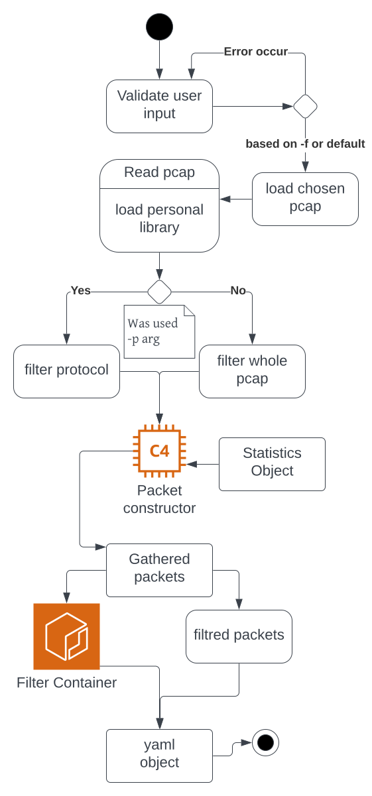
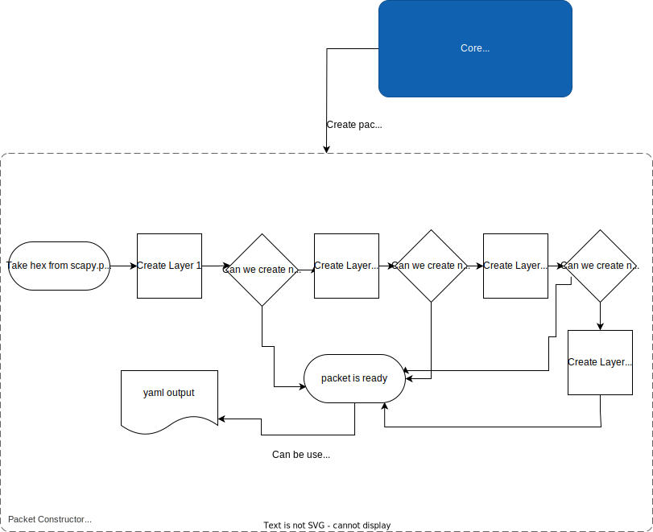
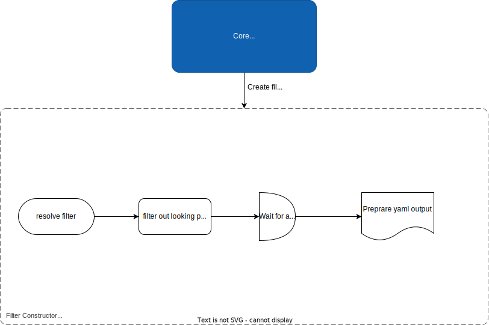

# Content

- [Content](#content)
- [Block design (concept) of the solution functionionality and the proposed mechanism for analyzing protocols on different layers.](#block-design-concept-of-the-solution-functionionality-and-the-proposed-mechanism-for-analyzing-protocols-on-different-layers)
    - [Introduction](#introduction)
    - [Capabilities](#capabilities)
    - [Architecture](#architecture)
    - [Output](#output)
- [Implementation](#implementation)
  - [Preprocessing](#preprocessing)
  - [Core processes](#core-processes)
    - [Packet class](#packet-class)
    - [Layers](#layers)
    - [Statistics](#statistics)
  - [Filter communication](#filter-communication)
  - [Output](#output-1)
- [Statistics](#statistics-1)
- [Example of external file structure for specifying protocols to be analyzed.](#example-of-external-file-structure-for-specifying-protocols-to-be-analyzed)
- [The choice of the implementation environment](#the-choice-of-the-implementation-environment)
- [Summary](#summary)
  - [Used libraries](#used-libraries)
  - [Used tools](#used-tools)
  - [Used sources](#used-sources)

---

# Block design (concept) of the solution functionionality and the proposed mechanism for analyzing protocols on different layers.

## Introduction

The main goal of the project is to create a tool for analyzing network protocols on different layers. The tool is designed like wireshark for school PKS (computer and communicative networks) subject. The tool is written in Python 3.11. How to start program is described in the [README.md](../README.md) file. 

## Capabilities

There are two main capabilities of the tool. The first one is to analyze all pcap file and give ipv4 statistics, the ref: *Wireshark -> Statistics -> IPv4 Statistics -> Source and Destination Addresses*. Second one is to analyze only one protocol.  
All output is in yaml format and saved in `analyzer/results` directory.

## Architecture

The tool is divided into three main parts: 

1. **Preprocessing** - this part is responsible for validation of input arguments, loading my library, reading pcap file and calling the right analyzer.

2. **Core processes** - this part is responsible for creating a list of packets. Each packet is an object of class `Packet` which contains all information about the packet. Based on the input arguments, the two situations can occur, the first one is to analyze all protocols, the second one is to analyze only one protocol. In the second case, the tool will call one of the analyzers, which will analyze only one protocol. 

3. **Output** - this part is responsible for creating yaml output and saving it to the file. In the end will be created an instance of module `tcp_ip.yaml` which will create yaml output. Based on diffuculty of output.

## Output

The output is in yaml format and saved in `analyzer/results` directory. The output name is of `("%Y%m%d-%H%M%S")` format. If protocol filter is used, the output will specify the protocol name.

# Implementation

Here is a activity diagram of the tool. It shows how the tool works. And now ill describe each part of the tool.



## Preprocessing

There are only two things to pay attention to here. The first one is to parse protocols file. That file consists of all protocols which can be analyzed. It have hex or decimal number and name of protocol. My library is responsible for parsing this file, with `parse_file` function. And saving all that information.

And last thing are classes of **communications** module. They are blackbox classes that is responsible for analyzing a specified protocol. They are called from `main.py` file.

## Core processes

Lets break `Packet` class object. Here is a container diagram with flowchart in it, describing how it works.



### Packet class

```csharp
class Packet {
    Layers create();
    void print_all();
    dict get_packet();
}
```

This class is responsible for creating a packet object. It takes a packet from pcap file and creates a packet object. Each layer has its own abstract class `Layer`. This class is responsible for creating a layer object. Each layer has its own class. For example, `Ethernet` class is responsible for creating an object of class `Ethernet`. This class is also responsible for printing all information about packet and creating a dictionary of packet. This dictionary is used for creating yaml output.

### Layers

```csharp
abstract class Layer {
    void print_all();
    Union[String,None] resolve_type(hex);
    dict get_packet();
}
```

To create next layer, the previous layer must be created. For example, to create `IPv4` layer, the `Ethernet` layer must be created.  
So if layer 2 isnt created, the layer 3 cant be created.

### Statistics

```csharp
class Statistics {
    void print_statistics();
    list[dict[str, str]] get_all_senders();
    list[str] get_max_send_packets_by();
}
```

Object type `Packet` needs a `Statistics` object. This object is responsible for creating statistics of ipv4. It creates a dict of all senders and count of packets. 

## Filter communication

```csharp
class Com {
    dict to_yaml();
}
```

This is abstract class of all filter communications. In the `main.py` file is created one of the filter communication class. This class is responsible filtering out packets looking for specified protocol. For example, if the protocol is `ARP`, the `ARPCom` class is created. This class is responsible for filtering out packets looking for ARP protocol.

```csharp
class ARPCom extends Com {
    private void _parse_packets();
    void print_result();
    dict to_yaml();
}
```



## Output

I have `Basic` and `Advanced` output classes. The second one extends the first one. The first one is responsible for creating basic yaml output. For all protocols. It have main logic. 

```csharp
class Basic {
    dict create_data_to_dump();
    void create_file();
}
```

`Basic` class as the next one gets already parsed list of packets. It creates a dictionary and go throw all packets, calles their `get_packet` function that returns a dictionary of packet. And then it creates a yaml output.

```csharp
class Advanced extends Basic {
    dict create_data_to_dump();
}
```

The difference between `Basic` and `Advanced` class is that the second one gets an instance of Com communication and calls its `to_yaml` function. This function returns a dictionary. And then it creates a yaml output.

# Statistics

Its a global class that saves statistics of all packets. All packets saves their information to this class. And then, at the end output class puts this information to the yaml output.

# Example of external file structure for specifying protocols to be analyzed.

```txt
#ListOfEthernetII
0200 XEROX
0201 PUP
0800 IPv4
...
#ListOfIPv4
01 ICMP
02 IGMP
...
```

I use that file for parsing protocols. It is in `analyzer/protocols/set.txt` file. It is parsed by my library. 

# The choice of the implementation environment

I use Python 3.11. I use it because I have experience with it. I use it for school and for my personal projects. I use it for writing scripts and for writing web applications. It also easier to create programs with Py.

# Summary

The idea to create own tool for analyzing network protocols on different layers is very interesting. I have learned a lot of new things. Too bad that only the yaml output that we are forced to do cannot be changed. I would add/change a couple of things there. But I understand that its easier to control and check them for specified schema.

## Used libraries

- **scapy** - for reading pcap file and creating packets
- **argparse** - for parsing input arguments
- **ruamel.yaml** - for creating yaml output

## Used tools

- **vscode** - for writing code
- **wireshark** - for testing and debugging
- **git** - for version control

## Used sources

- **TFTP Guide** - http://www.tcpipguide.com/free/t_TFTPDetailedOperationandMessaging-3.htm
- **The Task** - https://github.com/fiit-ba/pks-course/tree/main/202324/assignments/1_network_communication_analyzer